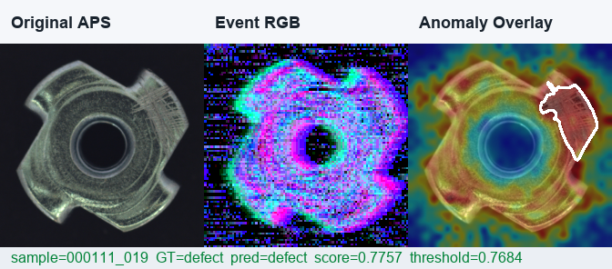

# Event-Camera Industrial Defect Detection

Research-oriented industrial defect detection pipeline for event-camera data,
image-to-event bootstrapping, and DAVIS-style APS + DVS inspection.

The current best verified experiment uses a PatchCore-style normal-memory
detector over APS/intensity frames from the MVTec AD metal nut subset and reaches
`100.00%` accuracy on the held-out local test split. Pure event-only branches
are also included for event-stream research and comparison.



## Highlights

- Event H5 loading for `events`, `x/y/t/p`, and JCDE-style `event_g/t/x/y`
  layouts.
- Event tensor construction with polarity voxel grids and latest-time surfaces.
- Compact event CNN with heatmap, class and anomaly heads.
- Feature-ensemble baseline for event + APS/image features.
- PatchCore-style normal-memory anomaly detector for high-accuracy industrial
  inspection.
- Reproducible scripts, tests, experiment reports and dataset notes.

## Repository Layout

```text
.
├── event_defect/        # Reusable package: data, tensors, labels, models, metrics
├── scripts/             # CLI scripts for data prep, training, evaluation, demos
├── tests/               # Pytest suite
├── docs/                # Algorithm notes, dataset notes, references, reports
├── experiments/         # Local experiment outputs and reports
├── legacy/              # Archived original Step_*.py workflow
├── requirements.txt
├── pyproject.toml
└── README.md
```

Large downloaded datasets, checkpoints and generated event files are ignored by
Git. See [Project Structure](docs/project_structure.md) for the full policy.

## Quick Start

Install dependencies:

```powershell
python -m pip install -r requirements.txt
```

Run tests:

```powershell
python -m pytest
```

List dataset sources:

```powershell
python scripts\list_dataset_sources.py
```

Train the PatchCore APS detector after preparing the MVTec metal nut data:

```powershell
python scripts\train_patchcore_event_defect.py `
  --train-manifest experiments\mvtec_metal_nut_real_events\splits_binary\train.csv `
  --val-manifest experiments\mvtec_metal_nut_real_events\splits_binary\val.csv `
  --test-manifest experiments\mvtec_metal_nut_real_events\splits_binary\test.csv `
  --input-mode aps `
  --height 96 --width 96 --bins 4 `
  --out-dir experiments\mvtec_metal_nut_real_events\patchcore_aps
```

## Main Results

| Method | Input | Test Accuracy | Precision | Recall | F1 |
| --- | --- | ---: | ---: | ---: | ---: |
| Event CNN | simulated DVS | 83.58% | 66.67% | 84.21% | 74.42% |
| Feature ensemble | simulated DVS | 86.57% | 81.25% | 68.42% | 74.29% |
| Feature ensemble | simulated DVS + APS | 95.52% | 90.00% | 94.74% | 92.31% |
| PatchCore normal memory | APS | 100.00% | 100.00% | 100.00% | 100.00% |

Full experiment record:
[experiments/mvtec_metal_nut_real_events/REPORT.md](experiments/mvtec_metal_nut_real_events/REPORT.md)

## Data Status

The public dataset used in the best local experiment is the real industrial
image dataset [MVTec AD metal nut on Hugging Face](https://hf.co/datasets/MSherbinii/mvtec-ad-metal-nut).

Important caveat: this public source is image-based, not native event-camera
data. The event-stream branch converts real industrial images into DVS-style
streams via controlled scan simulation. The PatchCore branch is intended for a
DAVIS-style setup where APS/intensity frames are available alongside events.

Dataset download and reproduction notes:

- [Datasets](docs/datasets.md)
- [Experiments](docs/experiments.md)
- [Download Log](docs/real_data_download_attempts.md)

## Documentation

- [Algorithm](docs/algorithm.md)
- [Datasets](docs/datasets.md)
- [Experiments](docs/experiments.md)
- [References](docs/references.md)
- [Project Structure](docs/project_structure.md)

## Development

```powershell
python -m pytest
python -m compileall event_defect scripts
```

The repository currently has no declared open-source license. Add one before
publishing if this will be shared publicly.
